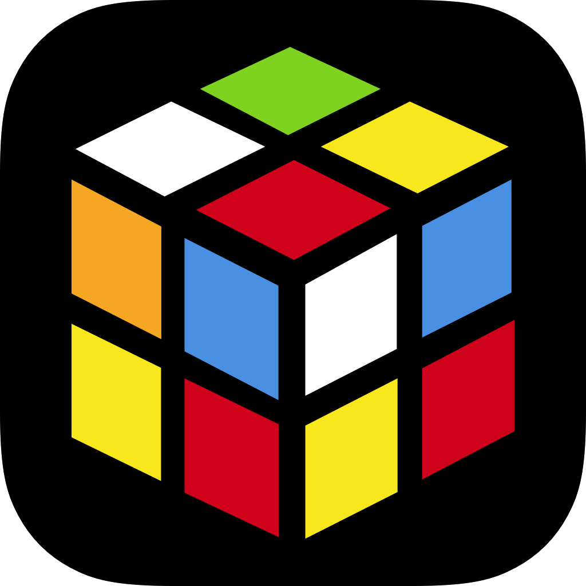

# CubeCFOP
Cube CFOP - A complete guide to solving the 3x3 Rubik Cube using one of the most popular speedsolving methods, the Fridrich method.

## Features:
1. F2L (First 2 Layers)
2. 1-Look OLL & 2-Look OLL (Orientation of Last Layer)
3. PLL (Permutation of Last Layer)
4. Notations Page
5. A unique favourites list with daily flashcards

Cube CFOP is an all in one application created for speedcubers by speedcubers. With 41 F2L cases, 51 OLL cases and 27 PLL cases, our application allows you to not only select the preferred algorithm for your case but also save these algorithms to your favourites list.
